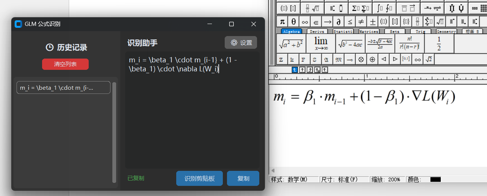

# 🧮 FormulaOCR 公式识别助手

FormulaOCR 是一款用于识别图片中数学公式的小工具，可以将截图、图片中的数学公式转换为 **MathType 可识别的代码**，方便在 Word、MathType 等工具中继续编辑和使用。

---

## ✨ 功能特点

* 📷 支持识别图片中的数学公式
* 🧠 基于智谱 AI 免费接口进行公式识别
* 📝 输出 MathType 可识别的公式代码
* ⚙️ 支持在软件中配置自己的 API Key
* 🚀 操作简单，适合学习、论文、教学等场景使用

---

## 📥 下载软件

请前往本项目的 **Releases** 页面下载最新版本压缩包：

👉 [点击进入 Releases 页面](../../releases)

下载后解压，即可运行软件。

---

## 🔑 API Key 获取方法

本软件需要使用智谱 AI 的 API Key。智谱 AI 官网目前提供免费的 API 使用额度。

### 1. 进入智谱 AI 官网

官网地址：

```text
https://bigmodel.cn/
```

---

### 2. 进入控制台

登录后，进入智谱 AI 控制台。


---

### 3. 创建 API Key

在控制台中找到 API Key 管理页面，然后创建新的 API Key。


---

### 4. 将 API Key 填入软件设置

打开 FormulaOCR 软件，进入设置页面，将刚才复制的 API Key 粘贴进去并保存。

---

## 🖼️ 使用效果

配置完成后，上传或粘贴数学公式图片，即可识别出 MathType 可识别的公式代码。



---

## 📌 使用流程

```text
下载软件 → 解压运行 → 获取 API Key → 填入软件设置 → 上传公式图片 → 复制识别结果
```

---

## ⚠️ 注意事项

* 请妥善保管自己的 API Key，不要公开分享。
* 如果识别失败，请检查 API Key 是否填写正确。
* 图片越清晰，公式识别效果通常越好。
* 建议使用截图工具截取清晰的公式图片后再进行识别。

---


## 📄 License

本项目仅供学习和个人使用。
